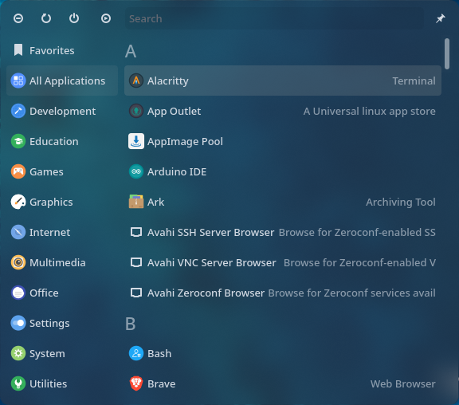
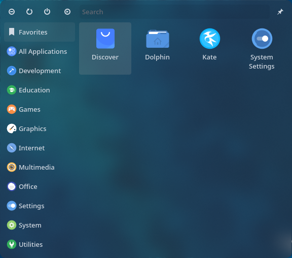
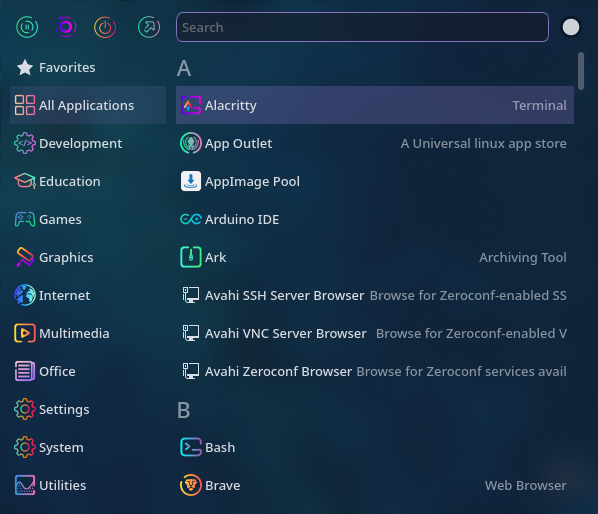
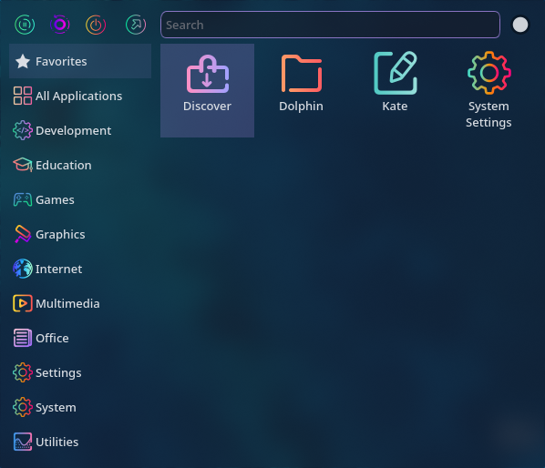
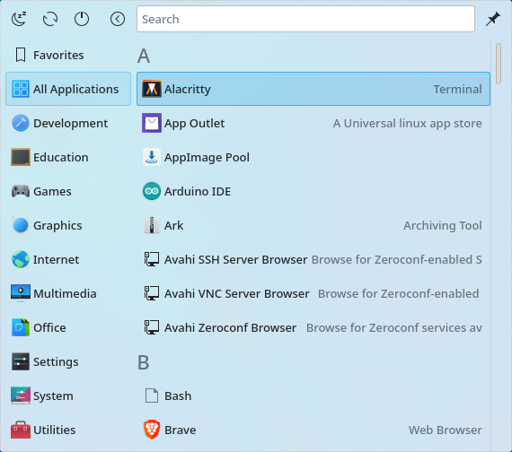
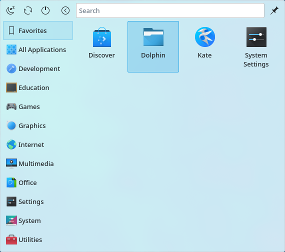

 <h1 align="center">Simple Kickoff</h1>
 
A simplified fork of KDE Plasma's default Kickoff Application Launcher

 
 
 
 
 
 

  <a href="#gallery">View Screenshots</a>
  |
  <a href="#powerful-plasma-search">Powerful Plasma Search</a>
  |
  <a href="#prerequisites">Install</a>
  |
  <a href="#changes-made-over-default-kickoff">Differences from Kickoff</a>

This is a simplified fork of Kickoff which is KDE Plasma Desktop's default Application launcher. The design is minimalized without compromising on power and important features.

## Powerful Plasma Search
The search bar uses `Plasma Search`, which is the same search provider used in the default Kickoff, Krunner and the Overview effect which supports powerful plugins.

###### **NOTE:** The initial codebase was copied from Kickoff which can be found in `/usr/share/plasma/plasmoids/org.kde.plasma.kickoff/`, on every Linux system that has KDE Plasma installed.

## Prerequisites:
* Linux based Operating System

* [KDE Plasma Desktop Environment](https://kde.org/plasma-desktop/)

<h1 align="center">Get it on</h1>

  
  
  

Install it directly from any of the above mentioned sources

or

If you download the file, extract it, open a terminal in the directory containing the `metadata.desktop` file and execute the following command:

  <pre>kpackagetool5 -t Plasma/Applet --install</pre>

## Changes made over default Kickoff:

* Removed the Places tab and page
* Removed the Configure button (This feature can still be accessed by right clicking the widget icon and `Configure Simple Application Launcher..`)
* Unified design: Removed the header and footer, and every component now shares the same background

<h1 align="center">Gallery</h1>

  

  

